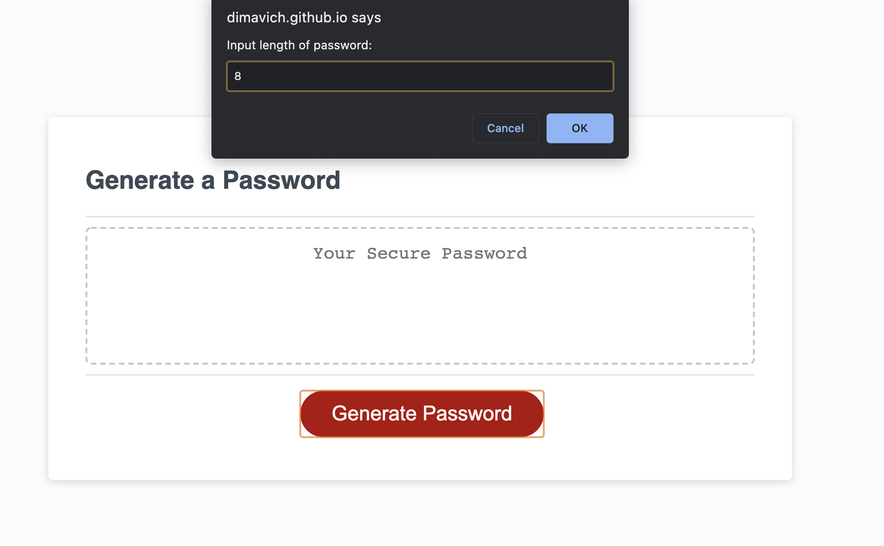
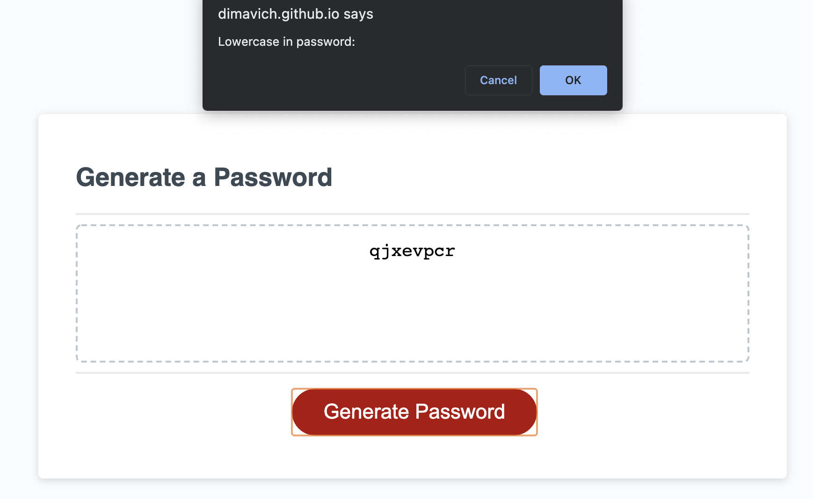
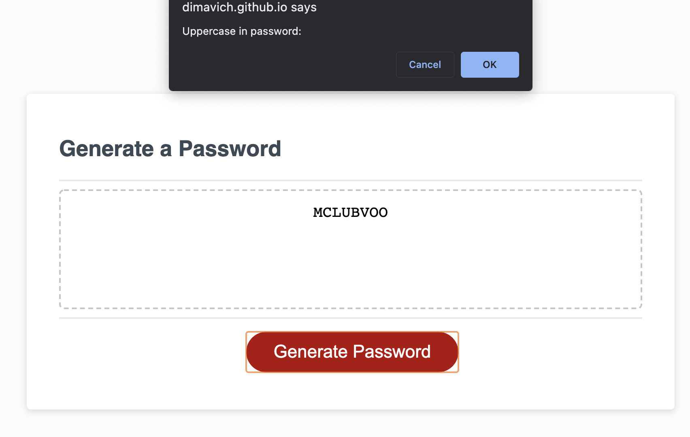
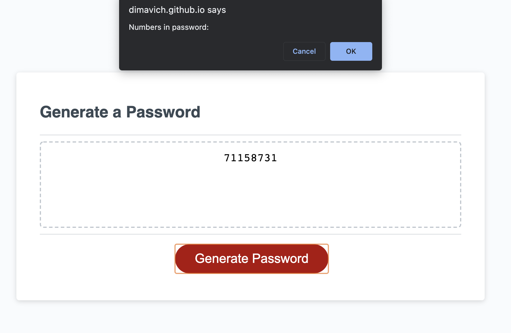
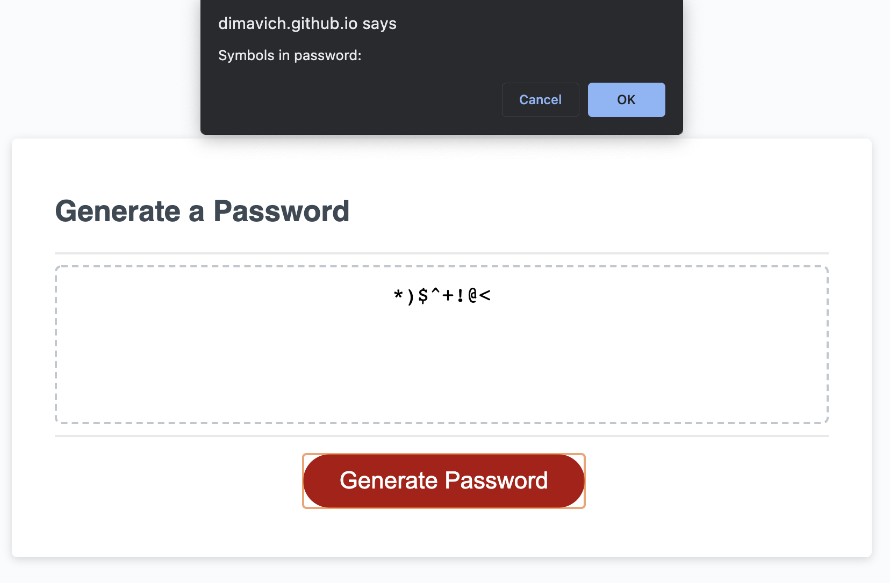
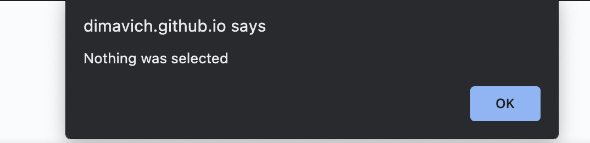
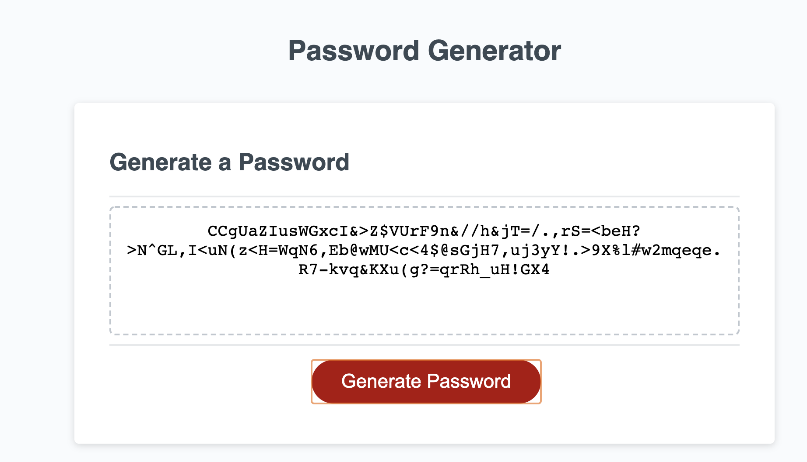

# secure-password-generator

## Discription 

## User Perameters

### length : How long you want your password to be **Note:** the accepted range is from 8 to 128 characters

### lower-case letters : Do you want random lowercase letters generated in the password 

### upper-case letters : Do you want upper case letters to be generated with the password

### numbers : Do you want numbers to be generated in the password

### symbols : Do you want symbols to be generated in the password 

### Selection 

You must choose at least one of the perameters that doesn't include length or no password will be generated

## finished product

